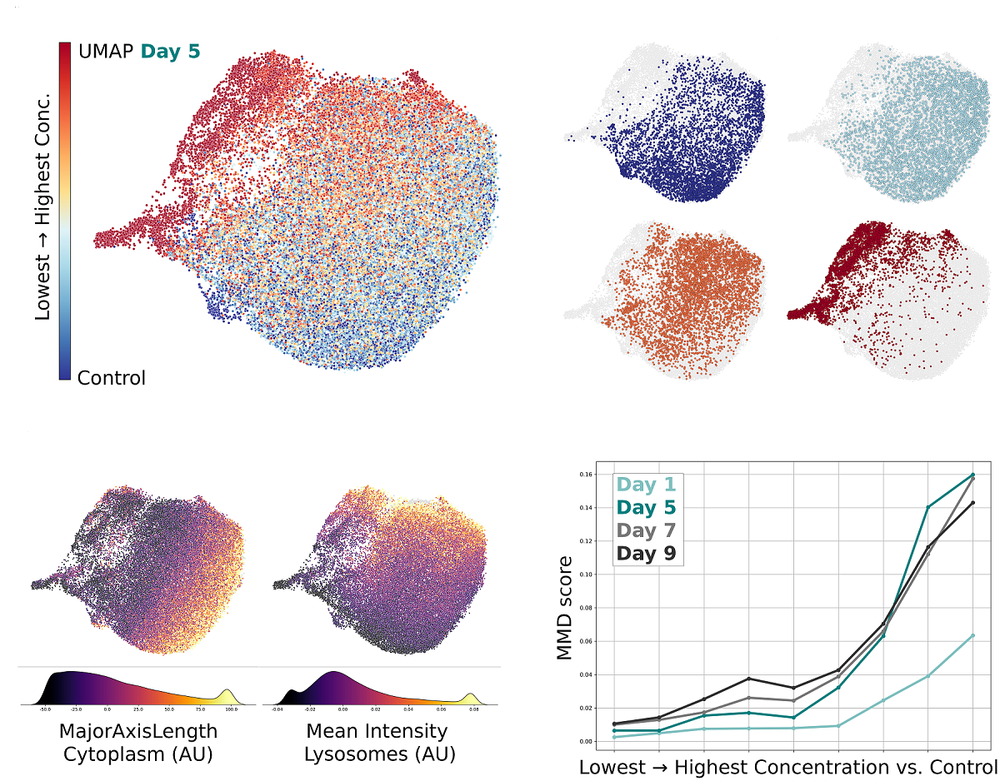
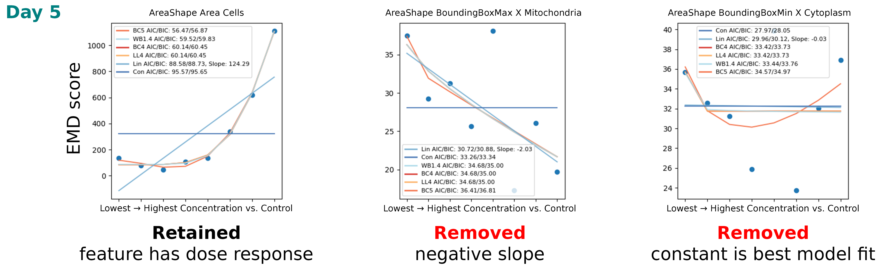

# High-Content Screening data processing pipeline

Data processing pipeline for High-Content Screening using CellProfiler data.

This set of scripts was used for *doi:xxx*

Training set and partial results are available at: *doi:xxx*

Follow the exact sequence of steps to perform the full analysis.

# MAIN FEATURE EXTRACTION

## SETTING MYSQL FOR QUALITY CONTROL

folder for scripts: /PATH/TO/preprocessing/qc/scripts

login to MySQL

CREATE DATABASE "name";

X11 forwarding enabled

Activate environment:
`conda activate cp4`

Run:
`cellprofiler`

Modify the **2024-07-20_QC.cpproj**

	Experiment name: "name"
	Database name: "name"
	Database host: 127.0.0.1 *insert yours*
	username: *ADD_FOR_MYSQL*
	password: *ADD_FOR_MYSQL*
	Overwrite without warning? Data only
	Table prefix: "name"

## SETTING NEXTFLOW FOR QUALITY CONTROL

To create **image_ranges.txt**; modify in **image_ranges.sh**:

    IMAGE_DIR="/PATH/TO/IMAGES/"
    NUM_INSTANCES=20  # Number of parallel instances
    OUTPUT_FILE="/PATH/TO/IMAGES/preprocessing/image_ranges_qc.txt"

Run:
`./image_ranges.sh`

In Quality control nextflow file QC **nf_qc.nf** file.
Modify the:

    params.IMAGE_DIR="/PATH/TO/IMAGES/"
    params.OUTPUT_DIR="/PATH/TO/preprocessing/qc"
    params.PIPELINE = "/PATH/TO/preprocessing/2024-07-20_QC.cpproj"
    params.IMAGE_RANGES = "/PATH/TO/preprocessing/image_ranges_qc.txt"

Move to the installed nextflow folder with modified **nf_qc.nf** file.

Activate environment:
`conda activate nextflow`

Run:
`nextflow run nf_qc.nf -bg -with-conda`

Close the terminal

## QUALITY CONTROL LIST + FILTERING

change created .properties file in "/PATH/TO/preprocessing/qc"

	db_port      = 3307 #3007 as example → use your MySQL port
	db_host      = localhost

Move to the CellProfiler-Analyst folder

X11 forwarding enabled

Activate environment:
`conda activate cpa3_scikit`

Run:
`python CellProfiler-Analyst.py`

In case of error while opening **.properties** file, try to load the **.properties** file 3 times in CellProfiler-Analyst → it will work the 3rd time.

### CREATE/USE THE CLASSIFIERS

in CellProfiler-Analyst GUI open each classifier, load + **Score All** the following Classifier Models and save each table as a .csv file:

    artefacts_i6.model → tagged_artefacts.csv
    empty_i3.model → tagged_empty.csv
    oversaturated_i2.model → tagged_oversaturated.csv

Exit the Classifier → from Main menu of the CellProfiler-Analyst GUI → Table view → File → Load table from database → "name"Per_Image → File → Save table to CSV → save as "imageID.csv"

Activate environment:
`conda activate utility_tools`

Move to the location of the qc scripts (/PATH/TO/preprocessing/scripts).

Modify the **parsing_imageID.py**:

    source_directory = "/PATH/TO/preprocessing/qc"
    destination_directory = "/PATH/TO/preprocessing/qc/remove"

Run:
`python parsing_imageID.py`

Modify the **remove_images.sh**:

    CSV_FILE="/PATH/TO/preprocessing/qc/remove/remove_image_list.csv"
    SOURCE_DIR="/PATH/TO/IMAGES/"
    DEST_DIR="/PATH/TO/input_removed"

Run:
`./remove_images.sh`

## MAIN FEATURE EXTRACTION IN CELLPROFILER

folder for scripts: /PATH/TO/main_cp/scripts

make new image ranges:
modify the script **image_ranges.sh** in main_cp folder:

    IMAGE_DIR="/PATH/TO/IMAGES/"
    OUTPUT_FILE="/PATH/TO/main/image_ranges_main.txt"

Run:
`./image_ranges.sh`

cd nextflow_cp

Move to the installed nextflow folder with modified filed **main.nf**:

    params.IMAGE_DIR = "/PATH/TO/IMAGES/"
    params.OUTPUT_DIR = "/PATH/TO/main/results"
    params.PIPELINE = "/PATH/TO/main/2024-07-16_main_pipeline_nocut.cpproj"
    params.IMAGE_RANGES = "/PATH/TO/main/image_ranges_main.txt"

Activate environment:
`conda activate nextflow`

Run:
`nextflow run 2024-07-24_the_main_nocut.nf -bg -with-conda`

## PER CELL POOLING

folder:
/PATH/TO/main/

Activate environment:
`conda activate utility_tools`

move to the location of main_cp scripts

change in **combine_and_filter.py**:

    main_dir = "/PATH/TO/main/results"

Run:
`python combine_and_filter.py`

change in **create_cell_ID.py**:

    base_dir = '/PATH/TO/main/results'

Run:
`python create_cell_ID.py`

change **config.ini** & **config_day_well_br.ini**

    base_dir = /PATH/TO/main/results

Run in sequence:

`python create_day_well_br.py`

`python pooling_cell_ID_v3.py`

`python pooling_day_well_br_v9.py`

--------------------------------------------------------

# STANDARDIZATION

folder for scripts: /PATH/TO/standardization/scripts

**config.ini** setup:

    [standardization]
    base_path = /PATH/TO/
    input_file = main/results/cell_ID_pooled_median.txt
    output_dir = main/results
    feature_selection_dir = feature_selection/results

Change the base_path + double check if the input file is where it should be.

Activate environment:
`conda activate utility_tools`

Run:
`python standardization_row_day.py`

Row effects were first corrected by calculating residuals for each feature by subtracting each measurement with its row median (a technical replica). Plate batch effects were subsequently mitigated by subtracting the median residual value across all four biological replicate plates from each individual residual.

## TRIMMING OF THE OUTLIERS

Activate environment:
`conda activate utility_tools`

Run:
`python only_trimming_well.py`

Trimming the standardized data, upper and lower 2.5% removed (on well level).

# FEATURE SELECTION

folder for scripts: /PATH/TO/feature_selection/scripts

**config.ini** setup:

    [feature_selection]
    base_path = /PATH/TO/
    # Input files - exact versions needed
    standardized_file = main/results/cell_ID_pooled_median_row_plate_standardization.txt
    trimmed_standardized_file = feature_selection/results/cell_ID_pooled_median_row_plate_standardization_trimmed_well_2.5_97.5.txt
    # Output directories
    emd_scores_dir = feature_selection/results/EMD_scores
    emd_scores_drc_dir = feature_selection/results/EMD_scores/drc
    emd_scores_drc_selected_dir = feature_selection/results/EMD_scores/drc/selected
    correlation_dir = feature_selection/results/correlation
    correlation_list_include_dir = feature_selection/results/correlation/list_include
    trimmed_dir = feature_selection/results/trimmed
    trimmed_2_dir = feature_selection/results/trimmed_2

Change the base_path + double check if the input files are where they should be.

## EMD CONTROLS

Activate environment:
`conda activate utility_tools`

Run:
`python emd_scores_controls_trimming_well_results.py`

Pair-wise comparison of biological replicas between controls → EMD scores

OPTIONAL:

Run:
`python plot_emd_controls.py`

Show plot of the distribution of EMD scores across all features between biological replicas.

## EMD PAIR-WISE COMPARISON

Activate environment:
`conda activate utility_tools`

Run:
`python emd_scores_concs_per_day.py`

Pair-wise comparison of all biological replicas against all treatments and all controls

## FEATURE SELECTION BASED ON DRC

Activate environment:
`conda activate utility_tools`

Run:
`plots_emd_model_drc.py`

Using calculated EMD scores of treatment vs. control → we fit different drc models → select feature if linear slop isn't negative + constant model isn't the best fit

Run:
`python select_features.py`

We define groups - the level on which we choose the features based on our criteria

OUTPUT: lists of features that we want o INCLUDE

Possible combinations in **select_features.py** (default is all_days → looks at the features across all days, the feature needs to meet the criteria across all day; the most strict selection)

    # Define day combinations
    day_combinations = {
        #"D1": ["D1"],
        #"D5": ["D5"],
        #"D7": ["D7"],
        #"D9": ["D9"],
        #"D1_D5_D7": ["D1", "D5", "D7"],
        #"D5_D7": ["D5", "D7"],
        "all_days": ["D1", "D5", "D7", "D9"],
    }

Run:
`python trimming_value_include_batch_v1_cid.py`

Uses list(s) we created with **select_features.py** and trims + filters the standardized data → saved into subsets

## FEATURE SELECTION BASED ON CORRELATION

Run:
`python correlation_feature_selection_well_batch.py`

We create lists for each subset of highly correlated features + dendrogram plots of hierarchical clustering

Run:
`python parsing_clusters.py`

We parse the created lists to only one feature per cluster in a new list (which features to include)

Run:
`trimming_value_include_batch_v2_cid.py`

Same as previous step, uses lists we created with **parsing_clusters.py** and trims + filters the standardized data → saved into subsets by FS based on days

# DIMENSIONALITY REDUCTION

## MAKING SUBSETS

**config.ini** setup:

    [dim_reduction_subsets]
    base_path = /PATH/TO/
    # Input file - final output from feature selection
    final_features_file = feature_selection/results/trimmed_2/clean_trimmed_features_all_days_trimmed_trimmed_features.txt
    # Output directories for subsets
    subsets_base_dir = dim_reduction/results/subsets
    subsets_all_days_fs_dir = dim_reduction/results/subsets/all_days_fs
    subsets_days_per_conc_dir = dim_reduction/results/subsets/all_days_fs/days_per_conc
    subsets_min_count_dir = dim_reduction/results/subsets/all_days_fs/min_count
    subsets_filtered_dir = dim_reduction/results/subsets/all_days_fs_filtered
    counts_output_dir = dim_reduction/results

Change the base_path + double check if the input files are where they should be.

### NUMBER OF CELLS PER BIOLOGICAL REPLICA AND OTHER

Activate environment:
`conda activate utility_tools`

Run:
`python count_conc_day_BR.py`

Counts cells per different points of view → useful to determine minimal counts at **subsample_series_days_per_concentrations.py**

### SUBSETS

Activate environment:
`conda activate utility_tools`

Run:
`python subsample_concentrations_per_day.py`

General UMAP visualization, 5k cells per concentration (per day); values of less are tolerated; makes for good visualization on UMAPs

Run:
`python subsample_series_min_count_cons_per_day.py`

Same number of cells across all concentrations (per day) for MMD/EMD/Mah

Run:
`python subsample_series_days_per_concentrations.py`

General UMAP visualization, Xk cells per day (per concentration; high concentrations have lower count)

Use counts to determine the actual numbers → in the script we have "def get_cutoff_for_concentration(concentration)" function, change the values accordingly to counts

### REMOVING FEATURES WITH MISSING VALUES

Activate environment:
`conda activate utility_tools`

Run:
`python filtering_subsets.py`

!! Remove from the /all_days_fs_filtered **feature_filtering_report.txt** because of further processing. !!

## VISUALIZATION

**config.ini** setup:

    [dim_reduction_visualization]
    base_path = /PATH/TO/
    # Input directories - filtered subsets
    subsets_filtered_dir = dim_reduction/results/subsets/all_days_fs_filtered
    subsets_days_per_conc_filtered_dir = dim_reduction/results/subsets/all_days_fs_filtered/days_per_conc
    subsets_min_count_filtered_dir = dim_reduction/results/subsets/all_days_fs_filtered/min_count
    # UMAP output directories
    umap_no_scaling_dir = dim_reduction/results/umap/no_scaling
    umap_qt_dir = dim_reduction/results/umap/QT
    umap_qt_3d_dir = dim_reduction/results/umap/QT_3d
    umap_qt_days_per_conc_dir = dim_reduction/results/umap/QT/days_per_conc
    umap_qt_coloring_dir = dim_reduction/results/umap/QT/coloring
    umap_qt_coloring_br_tr_dir = dim_reduction/results/umap/QT/coloring_BR_TR
    umap_qt_days_coloring_dir = dim_reduction/results/umap/QT/days_per_conc/coloring
    # MMD/EMD/Mahalanobis analysis
    mmd_emd_mah_output_dir = dim_reduction/results/mmd_emd_mah
    # Feature visualization
    sample_features_file = dim_reduction/results/subsets/all_days_fs_filtered/subsample_5k_D5.txt
    sample_embedding_file = dim_reduction/results/umap/QT/subsample_5k_D5_umap_embedding_QuantileTransformer.npy

Change the base_path + double check if the input files are where they should be.

### UMAP visualisation

Activate environment:
`conda activate umap`

Run in sequence:

`python umap_no_scaling_subsamples_concentrations.py` (OPTIONAL)

`python umap_QT_subsamples_concentrations.py`

`python umap_QT_subsamples_concentrations_3d.py`

`python umap_QT_subsamples_days.py`

`python umap_QT_sample_features_gradient_smaller.py`
can change which embedding and features to use

`python umap_QT_subsamples_concentrations_coloring.py`

`python umap_QT_subsamples_days_coloring.py`

`python umap_QT_subsamples_concentration_coloring_TR_BR.py`

### MMD/EMD/Mahalanobis visualisation

Activate environment:
`conda activate utility_tools`

Run:
`python mmd_emd_mah_drc.py`

MMD, EMD and Mahalanobis plots