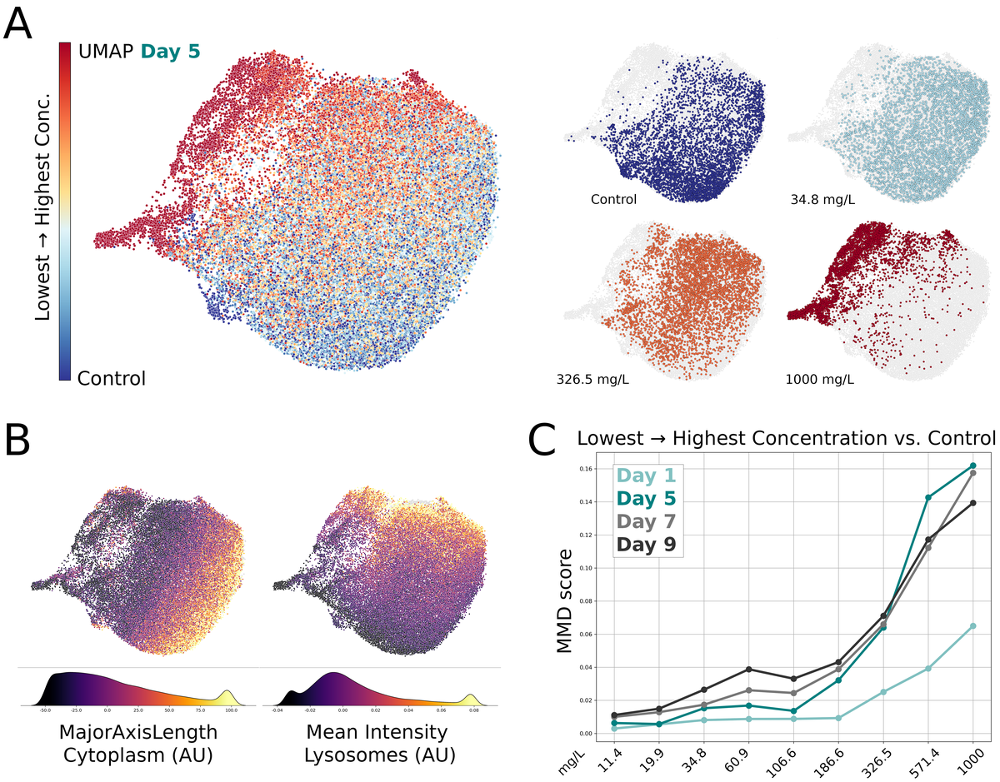
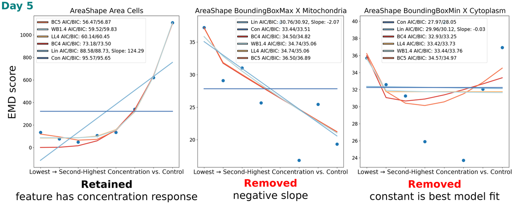
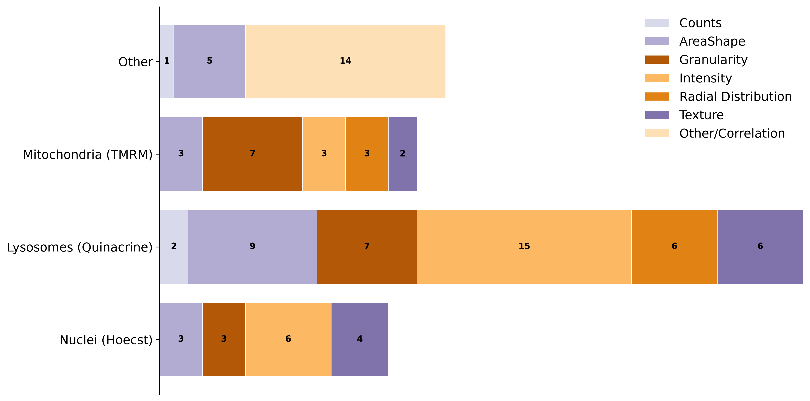
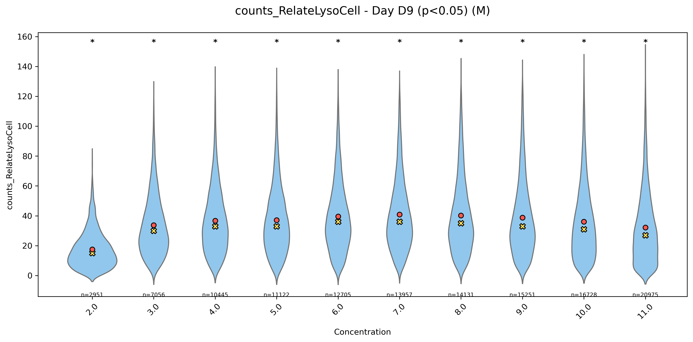

# High-Content Screening data processing pipeline

Data processing pipeline for High-Content Screening using CellProfiler data.

## Citation

This set of scripts was used for:

> Tome, M.; Jozef, B.; Mosimann, S. L.; Kosnik, M.; Schirmer, K.; Županič, A.
> **A High-Content Imaging Pipeline to Investigate Subcytotoxic Effects in RTgill-W1 Cells.**
> *Environmental Science & Technology* **2026**, *60* (31), 21402–21416.
> [https://doi.org/10.1021/acs.est.5c18316](https://doi.org/10.1021/acs.est.5c18316)
>
> M.T. and B.J. contributed equally to this work.

If you use this pipeline, please cite the article above. A `CITATION.cff` file is
included, so GitHub's *Cite this repository* button gives the same reference in BibTeX
or APA form.

To cite the code itself:

> Tome, M. **NIB-SI/HCS-proc.** *Zenodo*.
> [https://doi.org/10.5281/zenodo.17949847](https://doi.org/10.5281/zenodo.17949847)

That is the concept DOI and always resolves to the newest release. Release
[`v1`](https://github.com/NIB-SI/HCS-proc/releases/tag/v1) —
[10.5281/zenodo.17949848](https://doi.org/10.5281/zenodo.17949848) — is the exact code
used for the article; `main` carries the maintained pipeline, which has since been
corrected and extended.

## Data

Raw microscopy images, CellProfiler-extracted features, pipeline files and processed
data (Tebuthiuron exposure of RTgill-W1 cells) are archived on Zenodo under CC-BY-4.0
(~121 GB):

> [https://doi.org/10.5281/zenodo.17951792](https://doi.org/10.5281/zenodo.17951792)

That is the concept DOI and always resolves to the newest version; the version used in
the article is [10.5281/zenodo.17951793](https://doi.org/10.5281/zenodo.17951793).

## How to use this repository

Follow the exact sequence of steps below to perform the full analysis.

*Figure 2 of the article.*

# MAIN FEATURE EXTRACTION

## SETTING MYSQL FOR QUALITY CONTROL

folder for scripts: /PATH/TO/preprocessing/qc/scripts

login to MySQL

CREATE DATABASE "name";

X11 forwarding enabled

Activate environment:
`conda activate cp4`

Run:
`cellprofiler`

Modify the **2024-07-20_QC.cpproj** in CellProfiler GUI:

	Experiment name: "name"
	Database name: "name"
	Database host: 127.0.0.1 *insert yours*
	username: *ADD_FOR_MYSQL*
	password: *ADD_FOR_MYSQL*
	Overwrite without warning? Data only
	Table prefix: "name"

## SETTING NEXTFLOW FOR QUALITY CONTROL

To create **image_ranges.txt**; modify in **image_ranges.sh**:

    IMAGE_DIR="/PATH/TO/IMAGES/"
    NUM_INSTANCES=20  # Number of parallel instances
    OUTPUT_FILE="/PATH/TO/IMAGES/preprocessing/image_ranges_qc.txt"

Run:
`./image_ranges.sh`

In Quality control nextflow file QC **nf_qc.nf** file.
Modify the:

    params.IMAGE_DIR = "/PATH/TO/IMAGES/"
    params.OUTPUT_DIR = "/PATH/TO/preprocessing/qc"
    params.PIPELINE = "/PATH/TO/preprocessing/2024-07-20_QC.cpproj"
    params.IMAGE_RANGES = "/PATH/TO/preprocessing/image_ranges_qc.txt"

Move to the installed nextflow folder with modified **nf_qc.nf** file.

Activate environment:
`conda activate nextflow`

Run:
`nextflow run nf_qc.nf -bg -with-conda`

Close the terminal

## QUALITY CONTROL LIST + FILTERING

change created .properties file in "/PATH/TO/preprocessing/qc"

	db_port      = 3307 #3007 as example → use your MySQL port
	db_host      = localhost

Move to the CellProfiler-Analyst folder

X11 forwarding enabled

Activate environment:
`conda activate cpa3_scikit`

Run:
`python CellProfiler-Analyst.py`

In case of error while opening **.properties** file, try to load the **.properties** file 3 times in CellProfiler-Analyst → it will work the 3rd time.

### CREATE/USE THE CLASSIFIERS

in CellProfiler-Analyst GUI open each classifier, load + **Score All** the following Classifier Models and save each table as a .csv file:

    artefacts_i6.model → tagged_artefacts.csv
    empty_i5.model → tagged_empty.csv
    oversaturated_i2.model → tagged_oversaturated.csv

A fourth model, **unfocused_i6.model**, is included in `files/qc/classifier_models/` but
was *not* applied in the published analysis. Score it only if out-of-focus images are a
problem in your own dataset.

Exit the Classifier → from Main menu of the CellProfiler-Analyst GUI → Table view → File → Load table from database → "name"Per_Image → File → Save table to CSV → save as "imageID.csv"

Activate environment:
`conda activate utility_tools`

Move to the location of the qc scripts (/PATH/TO/preprocessing/scripts).

Modify the **parsing_imageID.py**:

    source_directory = "/PATH/TO/preprocessing/qc"
    destination_directory = "/PATH/TO/preprocessing/qc/remove"

Run:
`python parsing_imageID.py`

Modify the **remove_images.sh**:

    CSV_FILE="/PATH/TO/preprocessing/qc/remove/remove_image_list.csv"
    SOURCE_DIR="/PATH/TO/IMAGES/"
    DEST_DIR="/PATH/TO/input_removed"

Run:
`./remove_images.sh`

## MAIN FEATURE EXTRACTION IN CELLPROFILER

folder for scripts: /PATH/TO/main/scripts

make new image ranges:
modify the script **image_ranges.sh** in main folder:

    IMAGE_DIR="/PATH/TO/IMAGES/"
    NUM_INSTANCES=20  # Number of parallel instances
    OUTPUT_FILE="/PATH/TO/main/image_ranges_main.txt"

Run:
`./image_ranges.sh`

cd nextflow_cp

Move to the installed nextflow folder with modified filed **main.nf**:

    params.IMAGE_DIR = "/PATH/TO/IMAGES/"
    params.OUTPUT_DIR = "/PATH/TO/main/results"
    params.PIPELINE = "/PATH/TO/main/2024-07-16_main_pipeline_nocut.cpproj"
    params.IMAGE_RANGES = "/PATH/TO/main/image_ranges_main.txt"

Activate environment:
`conda activate nextflow`

Run:
`nextflow run main.nf -bg -with-conda`

## PER CELL POOLING

folder:
/PATH/TO/main/

Activate environment:
`conda activate utility_tools`

move to the location of main_cp scripts

change in **combine_and_filter.py**:

    main_dir = "/PATH/TO/main/results"

Run:
`python combine_and_filter.py`

change in **create_cell_ID.py**:

    base_dir = '/PATH/TO/main/results'

Run:
`python create_cell_ID.py`

change **config.ini** & **config_day_well_br.ini**

    base_dir = /PATH/TO/main/results

Run in sequence:

`python create_day_well_br.py`

`python pooling_cell_ID_v3.py`

`python pooling_day_well_br_v9.py`

--------------------------------------------------------

# STANDARDIZATION

folder for scripts: /PATH/TO/standardization/scripts

**config.ini** setup:

    [standardization]
    base_path = /PATH/TO/
    input_file = main/results/cell_ID_pooled_median.txt
    output_dir = main/results
    feature_selection_dir = feature_selection/results

Change the base_path + double check if the input file is where it should be.

Activate environment:
`conda activate utility_tools`

Run:
`python standardization_row_day.py`

Row effects were first corrected by calculating residuals for each feature by subtracting each measurement with its row median (a technical replica). Plate batch effects were subsequently mitigated by subtracting the median residual value across all four biological replicate plates from each individual residual.

## TRIMMING OF THE OUTLIERS

Activate environment:
`conda activate utility_tools`

Run:
`python only_trimming_well.py`

Trimming the standardized data, upper and lower 2.5% removed (on well level).

# FEATURE SELECTION

> **Also available as a standalone tool.** The concentration–response feature selection
> described in this section — EMD scores, multi-model DRC fitting, the retention rule and
> the correlation pruning — has been generalised into
> [**NIB-SI/cdr_FS**](https://github.com/NIB-SI/cdr_FS), a pip-installable,
> configuration-driven package that does not assume the RTgill-W1 experimental design.
> Its defaults reproduce the run described below.
>
> The scripts in this repository remain the record of what was actually run for the
> article; use them to reproduce it, and `cdr_FS` to apply the method to another dataset.

folder for scripts: /PATH/TO/feature_selection/scripts

**config.ini** setup:

    [feature_selection]
    base_path = /PATH/TO/
    # Input files - exact versions needed
    standardized_file = main/results/cell_ID_pooled_median_row_plate_standardization.txt
    trimmed_standardized_file = feature_selection/results/cell_ID_pooled_median_row_plate_standardization_trimmed_well_2.5_97.5.txt
    # Output directories
    emd_scores_dir = feature_selection/results/EMD_scores
    emd_scores_drc_dir = feature_selection/results/EMD_scores/drc
    emd_scores_drc_selected_dir = feature_selection/results/EMD_scores/drc/selected
    correlation_dir = feature_selection/results/correlation
    correlation_list_include_dir = feature_selection/results/correlation/list_include
    trimmed_dir = feature_selection/results/trimmed
    trimmed_2_dir = feature_selection/results/trimmed_2

    # Experimental parameters
    concentrations = 2,3,4,5,6,7,8,9,10,11
    control_concentration = 11
    # Concentrations excluded from DRC model fitting (comma-separated; leave empty for none).
    # The highest exposure concentration is left out so that concentration-response
    # detection stays within sub-cytotoxic exposure levels. EMD scores are still computed
    # for every pair; only the curve fitting skips these. With the values above this fits
    # the eight pairs 11v10, 11v9, ... 11v3.
    drc_excluded_concentrations = 2
    days = D1,D5,D7,D9
    bioreps = BR1,BR2,BR3,BR4

    # Plotting
    # Plots per row/column in the DRC model-fit images (1 = one plot per image, 5 = 5x5 grid).
    # Each subplot is 8x8 inches, so the figure scales with this value.
    drc_grid_size = 3

    # Feature selection criteria
    # Use comma-separated days for DRC feature selection (e.g., D1,D5,D7,D9 or D5,D7) - specifically meaning, DRC logic will check all the selected days, the feature MUST be accepted on all the days to be retained; more days selected = more strict.
    selection_days = D1,D5,D7,D9

    # Experiment structure - defines which biological replicates exist for each day
    [experiment_structure]
    # List of days must match the days parameter above
    # For each day, specify which biological replicates are available
    D1_replicates = BR1,BR2,BR3,BR4
    D5_replicates = BR1,BR2,BR3,BR4
    D7_replicates = BR1,BR2,BR3,BR4
    D9_replicates = BR1,BR2,BR3,BR4

Change the base_path + double check if the input files are where they should be and the experimental parameters are correct.

## EMD CONTROLS

Activate environment:
`conda activate utility_tools`

Run:
`python emd_scores_controls_trimming_well_results.py`

Pair-wise comparison of biological replicas between controls → EMD scores

OPTIONAL:

Run:
`python plot_emd_controls.py`

Show plot of the distribution of EMD scores across all features between biological replicas.

## EMD PAIR-WISE COMPARISON

Activate environment:
`conda activate utility_tools`

Run:
`python emd_scores_concs_per_day.py`

Pair-wise comparison of all biological replicas against all treatments and all controls

## FEATURE SELECTION BASED ON DRC

*Figure 4 of the article.*

Activate environment:
`conda activate utility_tools`

Run:
`python plots_emd_model_drc.py`

Using calculated EMD scores of treatment vs. control → we fit different drc models → select feature if linear slope isn't negative + constant model isn't the best fit

Models fitted per feature and day: Brain-Cousens (BC4, BC5), four-parameter log-logistic (LL4), four-parameter Weibull (WB1.4), linear (Lin) and constant (Con). AIC/BIC per model are written to `model_fit_results.txt` in **emd_scores_drc_dir**, alongside one PNG per day and grid page (`Day_<day>_part_<n>.png`); how many plots share a page is set by **drc_grid_size**.

The curves are fitted to the pairs 11v10, 11v9, ... 11v3 — the highest exposure concentration is excluded via **drc_excluded_concentrations** so that concentration-response detection stays within sub-cytotoxic exposure levels. The EMD scores from the previous step still cover every pair; only the fitting skips the excluded ones. The script prints the pairs it is fitting when it starts.

Run:
`python select_features.py`

We define groups - the level on which we choose the features based on our criteria

OUTPUT: lists of features that we want o INCLUDE

Possible combinations in **select_features.py** (default is all_days → looks at the features across all days, the feature needs to meet the criteria across all day; the most strict selection)

    # Define day combinations
    day_combinations = {
        #"D1": ["D1"],
        #"D5": ["D5"],
        #"D7": ["D7"],
        #"D9": ["D9"],
        #"D1_D5_D7": ["D1", "D5", "D7"],
        #"D5_D7": ["D5", "D7"],
        "all_days": ["D1", "D5", "D7", "D9"],
    }

Run:
`python trimming_value_include_batch_v1_cid.py`

Uses list(s) we created with **select_features.py** and trims + filters the standardized data → saved into subsets

## FEATURE SELECTION BASED ON CORRELATION

Run:
`python correlation_feature_selection_well_batch.py`

We create lists for each subset of highly correlated features + dendrogram plots of hierarchical clustering

Run:
`python parsing_clusters.py`

We parse the created lists to only one feature per cluster in a new list (which features to include)

Run:
`python trimming_value_include_batch_v2_cid.py`

Same as previous step, uses lists we created with **parsing_clusters.py** and trims + filters the standardized data → saved into subsets by FS based on days

# FEATURE CATEGORIZATION

folder for scripts: /PATH/TO/categorization/scripts

Summarizes which kinds of measurement, on which organelle, survived feature selection.

*Selected features by organelle and measurement type, as produced by the scripts below.
Generated from the feature-selection output, before the missing-data filter applied when
making subsets, so the totals are slightly higher than those quoted in the article.*

**config.ini** setup:

    [categorization]
    base_path = /PATH/TO/
    # Input for build_feature_categories.py - any pooled/standardized table; only its
    # header row is read, to get the full feature list before feature selection
    all_features_file = main/results/cell_ID_pooled_median_row_plate_standardization.txt
    # Input for count_feature_types.py - the feature list left after feature selection
    final_features_file = feature_selection/results/trimmed_2/clean_trimmed_features_D1_D5_D7_D9_trimmed_trimmed_features.txt
    # Output directory for types.txt and the barplots
    output_dir = categorization/results

    # Universal feature -> category/organelle lookup. Ships with the repo, next to this
    # file, and is read relative to the script directory rather than base_path.
    feature_categories_file = feature_categories.tsv

    # Header columns of the pooled table that are not measured features
    metadata_columns = Concentration,Metadata_Well,Metadata_Day,Metadata_Biorep,Tech_replica,Day_Well_BR,cell_ID

    # Table layout - display order of the plotted columns and rows
    category_columns = Counts,AreaShape,Granularity,Intensity,Radial Distribution,Texture,Other/Correlation
    organelle_rows = Nuclei (Hoecst),Lysosomes (Quinacrine),Mitochondria (TMRM),Other

    # How the values recorded in feature_categories.tsv map onto those columns and rows.
    # Number holds rp_norm_Number_Object_Number_* object counts, grouped with Counts;
    # Correlation holds the colocalization measures, which span two channels.
    category_labels = Counts:Counts,Number:Counts,AreaShape:AreaShape,Granularity:Granularity,Intensity:Intensity,RadialDistribution:Radial Distribution,Texture:Texture,Correlation:Other/Correlation
    organelle_labels = Nuclei:Nuclei (Hoecst),Lysosomes:Lysosomes (Quinacrine),Mitochondria:Mitochondria (TMRM),Other:Other

    # Bar colours per category column, in the order above (ColorBrewer PuOr, colourblind-safe)
    colors = #d8daeb,#b2abd2,#b35806,#fdb863,#e08214,#8073ac,#fee0b6

## THE FEATURE CATEGORIZATION TABLE

**feature_categories.tsv** ships with the repository, next to the scripts. It is the
universal lookup: one row per CellProfiler feature, giving the measurement category and
the organelle that feature describes. It covers the whole feature set as measured, not
just the selected ones, so the same file serves any experiment run through this pipeline.

Activate environment:
`conda activate utility_tools`

OPTIONAL — only when a new experiment measures features that are not in the table yet:

Run:
`python build_feature_categories.py`

Reads the header of **all_features_file**, keeps every assignment already in the table,
and appends the features it has not seen. Category comes from the measurement module in
the name; organelle comes from the stain channel (`GrayLys`, `GrayMito`, `GrayNuclei`)
when there is one, and from the measured object (`RelateLysoCell`, `RelateMitoCell`,
`FilteredNuclei`, `Cells`, `Cytoplasm`) otherwise. Anything it cannot resolve is left
blank and printed, to be filled in by hand. Existing rows are never overwritten, so
corrections are safe across reruns.

## COUNTING AND PLOTTING THE CATEGORIES

Run:
`python count_feature_types.py`

Looks the selected features up in **feature_categories.tsv** and writes the organelle ×
measurement-type cross-tab to `types.txt` in **output_dir**. Any selected feature that is
missing from the table, or that has no assignment yet, is reported by name rather than
silently dropped.

Run:
`python plot_types.py`

Stacked barplots of that table, horizontal and vertical, at 300 dpi.

# DIMENSIONALITY REDUCTION

## MAKING SUBSETS

**config.ini** setup:

    [dim_reduction_subsets]
    base_path = /PATH/TO/
    # Input file - final output from feature selection
    final_features_file = feature_selection/results/trimmed_2/clean_trimmed_features_D1_D5_D7_D9_trimmed_trimmed_features.txt
    # Output directories for subsets
    subsets_base_dir = dim_reduction/results/subsets
    subsets_all_days_fs_dir = dim_reduction/results/subsets/all_days_fs
    subsets_days_per_conc_dir = dim_reduction/results/subsets/all_days_fs/days_per_conc
    subsets_min_count_dir = dim_reduction/results/subsets/all_days_fs/min_count
    subsets_filtered_dir = dim_reduction/results/subsets/all_days_fs_filtered
    counts_output_dir = dim_reduction/results
       
    # Experimental parameters
    days_to_include = D1,D5,D7,D9

Change the base_path + double check if the input files are where they should be and the experimental parameters are correct.

### NUMBER OF CELLS PER BIOLOGICAL REPLICA AND OTHER

Activate environment:
`conda activate utility_tools`

Run:
`python count_conc_day_BR.py`

Counts cells per different points of view → useful to determine minimal counts at **subsample_series_days_per_concentrations.py**

### SUBSETS

Activate environment:
`conda activate utility_tools`

Run:
`python subsample_concentrations_per_day.py`

General UMAP visualization, 5k cells per concentration (per day); values of less are tolerated; makes for good visualization on UMAPs

Run:
`python subsample_series_min_count_cons_per_day.py`

Same number of cells across all concentrations (per day) for MMD/EMD/Mah

Run:
`python subsample_series_days_per_concentrations.py`

General UMAP visualization, Xk cells per day (per concentration; high concentrations have lower count)

Use counts to determine the actual numbers → in the script we have "def get_cutoff_for_concentration(concentration)" function, change the values accordingly to counts

### REMOVING FEATURES WITH MISSING VALUES

Activate environment:
`conda activate utility_tools`

Run:
`python filtering_subsets.py`

## VISUALIZATION

**config.ini** setup:

    [dim_reduction_visualization]
    base_path = /PATH/TO/
    # Input directories - filtered subsets
    subsets_filtered_dir = dim_reduction/results/subsets/all_days_fs_filtered
    subsets_days_per_conc_filtered_dir = dim_reduction/results/subsets/all_days_fs_filtered/days_per_conc
    subsets_min_count_filtered_dir = dim_reduction/results/subsets/all_days_fs_filtered/min_count
    # UMAP output directories
    umap_no_scaling_dir = dim_reduction/results/umap/no_scaling
    umap_qt_dir = dim_reduction/results/umap/QT
    umap_qt_3d_dir = dim_reduction/results/umap/QT_3d
    umap_qt_days_per_conc_dir = dim_reduction/results/umap/QT/days_per_conc
    umap_qt_coloring_dir = dim_reduction/results/umap/QT/coloring
    umap_qt_coloring_br_tr_dir = dim_reduction/results/umap/QT/coloring_BR_TR
    umap_qt_days_coloring_dir = dim_reduction/results/umap/QT/days_per_conc/coloring
    # MMD/EMD/Mahalanobis analysis
    mmd_emd_mah_output_dir = dim_reduction/results/mmd_emd_mah
    # Feature visualization
    sample_features_file = dim_reduction/results/subsets/all_days_fs_filtered/subsample_5k_D5.txt
    sample_embedding_file = dim_reduction/results/umap/QT/subsample_5k_D5_umap_embedding_QuantileTransformer.npy
        
    # Experimental parameters
    concentrations = 2,3,4,5,6,7,8,9,10,11
    control_concentration = 11
    days = D1,D5,D7,D9
    bioreps = BR1,BR2,BR3,BR4
    tech_replicas = B,C,D
    
    # Color palettes (hex codes, comma-separated)
    # Colors for days (4 colors for D1,D5,D7,D9)
    day_colors = #2c7bb6,#abd9e9,#fdae61,#d7191c
    # Colors for bioreps (4 colors for BR1,BR2,BR3,BR4)
    biorep_colors = #2c7bb6,#abd9e9,#fdae61,#d7191c
    # Colors for tech replicas (3 colors for B,C,D)
    tech_replica_colors = #2c7bb6,#fdae61,#d7191c
    
    # Optional: Tech replica mapping (maps alternative names to standard names, if wells were changed)
    # Format: old_name:new_name (e.g., E:B means map E to B)
    # Leave empty if not needed
    tech_replica_mapping = E:B,F:C,G:D

Change the base_path + double check if the input files are where they should be and the experimental parameters are correct.

### UMAP visualisation

Activate environment:
`conda activate umap`

Run in sequence:

`python umap_no_scaling_subsamples_concentrations.py` (OPTIONAL)

`python umap_QT_subsamples_concentrations.py`

`python umap_QT_subsamples_concentrations_3d.py`

`python umap_QT_subsamples_days.py`

`python umap_QT_sample_features_gradient_smaller.py`
can change which embedding and features to use

`python umap_QT_subsamples_concentrations_coloring.py`

`python umap_QT_subsamples_days_coloring.py`

`python umap_QT_subsamples_concentration_coloring_TR_BR.py`

### MMD/EMD/Mahalanobis visualisation

Activate environment:
`conda activate utility_tools`

Run:
`python mmd_emd_mah_drc.py`

MMD, EMD and Mahalanobis plots

# ALTERNATIVE PROCESSING

### Selection of features based on high variability and/or low activity

Start from EMD scores from files:
PATH/TO/feature_selection/results/EMD_scores/EMD_conc_2.5_97.5_well.txt - treatment
PATH/TO/feature_selection/results/EMD_scores/EMD_c11_2.5_97.5_well.txt - control

Modify file **plots_emd_high_low.py**:

    treatment_file = 'PATH/TO/feature_selection/results/EMD_scores/EMD_conc_2.5_97.5_well.txt'
    control_file = 'PATH/TO//feature_selection/results/EMD_scores/EMD_c11_2.5_97.5_well.txt'
    output_dir = 'PATH/TO/feature_selection_high_low/results/EMD_scores'

### Z-score standardization

Start from per cell aggregated file:
PATH/TO/main/results/cell_ID_pooled_median.txt

Modify file **standardization_Z.py**:

    file_path = 'PATH/TO/main/results/cell_ID_pooled_median.txt'

### Violin Plots per Feature

Per-feature distributions across all concentrations, one plot per day, with the median (yellow X), the mean (red circle), the group size, and a Kruskal-Wallis result in the title.

*Example output: lysosome counts per cell on day 9. Concentration 11 is the control and 2 is the highest exposure, so dose increases to the left.*

Input files: any aggregated + standardized file, for example

`standardization/results/cell_ID_pooled_median_row_plate_standardization_cid.txt` — every feature, before feature selection

`feature_selection/results/trimmed_2/clean_trimmed_features_all_days_trimmed_trimmed_features_cid.txt` — only the features that survived selection

or any subset.

Activate environment:
`conda activate utility_tools`

**config.ini** setup:

    [violin_plots]
    base_path = /PATH/TO/
    input_file = feature_selection/results/trimmed_2/clean_trimmed_features_all_days_trimmed_trimmed_features_cid.txt
    output_dir = violin_plots/results

    # Columns that are metadata or object counts rather than plotted features. cell_ID
    # belongs here whenever the input is a _cid file - without it the cell identifier is
    # plotted as though it were a measurement.
    exclude_columns = Concentration,counts_Cells,counts_Cytoplasm,counts_FilteredNuclei,Metadata_Well,Metadata_Day,Metadata_Biorep,Tech_replica,Day_Well_BR,cell_ID

    # Worker processes; one feature is plotted per worker. Lower this on a shared machine.
    num_processes = 20

Run:
`python violin_plots_per_feature.py`

One directory per feature under **output_dir**, each holding one PNG per day. Point **input_file** at a different table and rerun to cover the other stage; nothing else needs to change.
